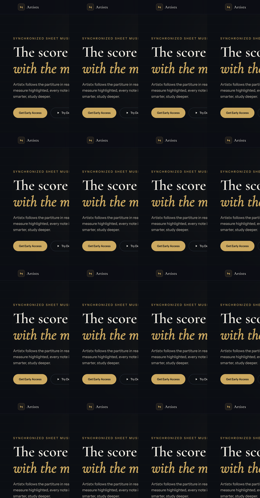

# Artistx

**Sheet music that moves with the music.**

Artistx is a music app that reads sheet music (partiture) while you listen — synchronized playback with the score. The notation scrolls and highlights in real time, so you always know exactly where you are in the piece.

Built for musicians learning new repertoire, practicing, or studying scores.

A music platform for streaming, publishing, and interactive play with real-time sheet music, enabling artists to monetize their work and collaborate with fans.

Features

Professional tools for music production.
Oriented to professionals and non-professionals individuals.
Free plan available.
Specialization level depending on the skills.
Live reading of musical scores.
Music streaming.
Offline mode available.
Private and public playlists available.
Masterization tools.
Classification for gender, location and mood.
Connect hardware such as microphone, keyboards or others.
Live lyrics real-time.
Recording feature.

## Preview

### Landing page

<p align="center">
  
</p>


## Run locally

```bash
npm install
npm run dev
```

Open [http://localhost:5173](http://localhost:5173) in your browser.

## Build

```bash
npm run build
npm run preview
```

## Tech stack

- [Vite](https://vite.dev/) + [React](https://react.dev/) + TypeScript
- [Tailwind CSS](https://tailwindcss.com/) v4
- Fonts: Cormorant Garamond (display) + Instrument Sans (body)

## Project structure

```
src/
  App.tsx                 # Landing page layout
  components/
    Hero.tsx              # Hero section with CTA
    SheetMusicMock.tsx    # Stylized score + playhead illustration
    Features.tsx          # Feature cards & use cases
    Cta.tsx               # Early access waitlist section
    Footer.tsx            # Footer with placeholder links
docs/
  screenshots/            # README preview images
```
